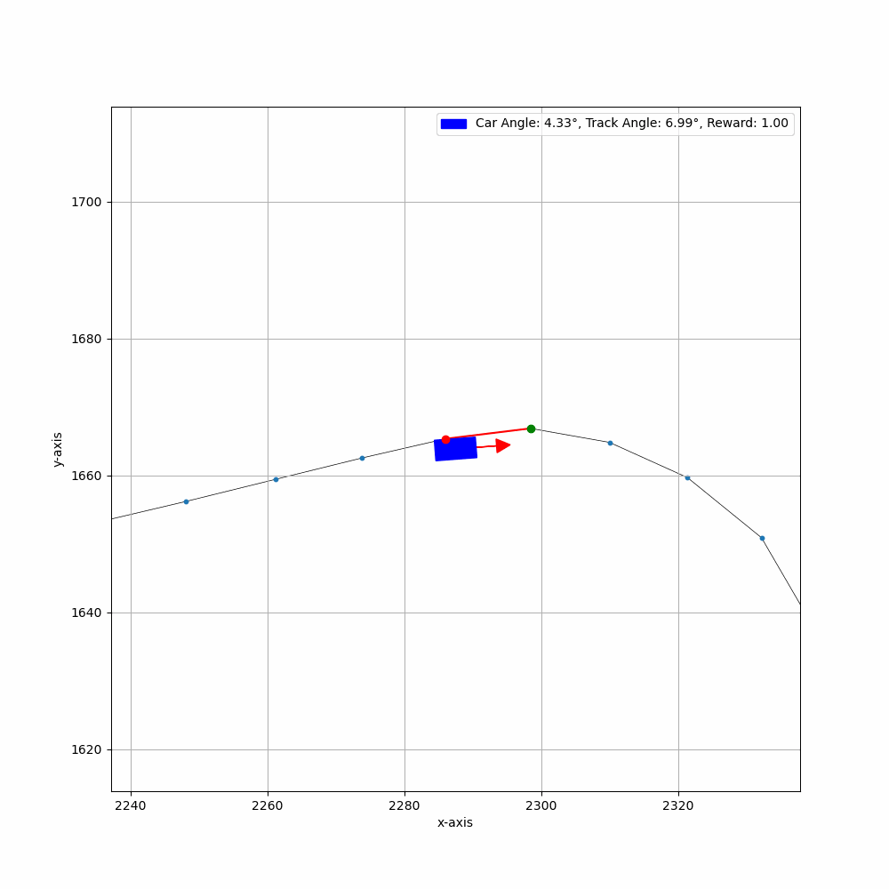
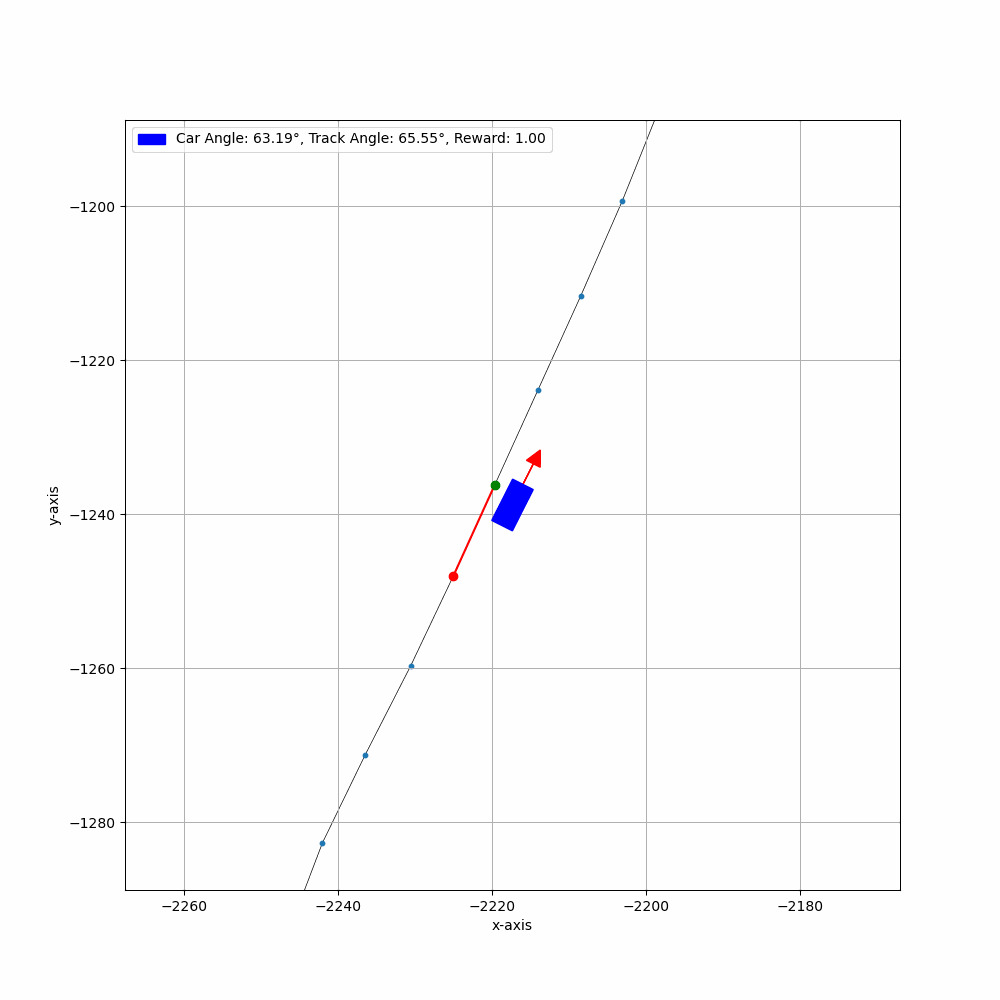
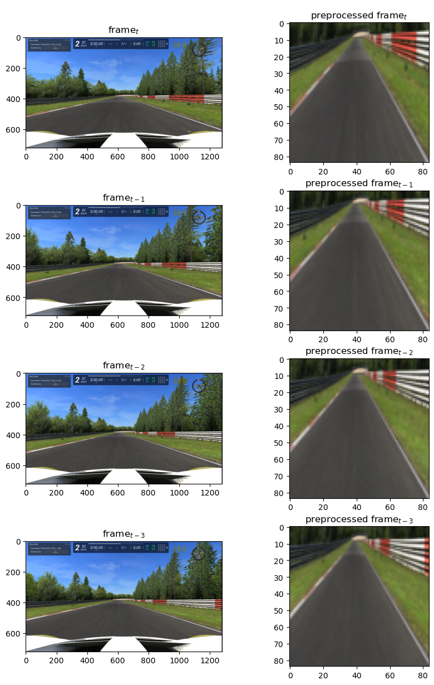

# AlienRL: An RL Environment for Assetto Corsa with PPO implementation

In this project, we have developed a reinforcement learning environment for the racing simulator Assetto Corsa. The environment is based on the OpenAI Gym interface and is designed to be used with the Proximal Policy Optimization (PPO) algorithm. The environment is designed to be used with the [Assetto Corsa Content Manager](https://assettocorsa.club/content-manager.html).

<table>
    <!-- <tr>
        <td colspan="2">
            
        </td>
    </tr> -->
    <tr>
        <td colspan="2">
             
        </td>
    </tr>
    <tr>
        <td>
            
        </td>
        <td>
            
        </td>
    </tr>
    <tr>
        <td colspan="2">
             
        </td>
    </tr>
    <tr>
        <td rowspan="2">
            
        </td>
        <td>
            
        </td>
    </tr>
    <tr>
        <td>
            
        </td>
    </tr>  
</table>
